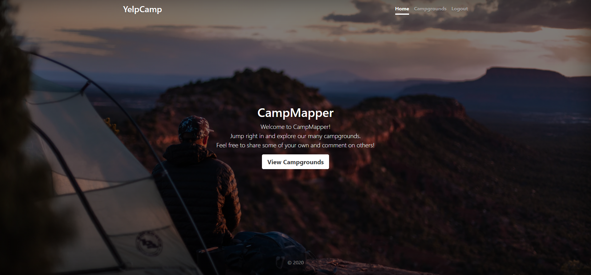

# Udemy Web Developer Bootcamp Final Project

This express app is the final project [The Web Developer Bootcamp](https://www.udemy.com/course/the-web-developer-bootcamp/) at Udemy. A simple campsite rating website is created (Check [screenshots](screenshots) folder) 

## Overview

### Technology Stack
MERN stack is leveraged without React front end(*MongoDB, Express, NodeJS*). For front and Bootstrap 5.0 is used. 
- Other dominant modules are `mongoose`, `ejs-mate`, `passport`, `joi`, `connect-flash` and `cloudinary`

### Usage
Some of the backend functionalities
- RestfulAPI, CRUD and Validation
- Authorization and authentication
- Session and cookies
Some of frontend functionalities
- Register and login as a user
- Post, update, view and review a campsite
- Mapbox integration 

### Deployment Infrastructure
- **Heroku**: to serve website, *but currently not running.*
- **MongoDB** & **Mongo Atlas**: NoSQL database
- **Cloudinary**: to serve images

## Quick Start

Follow these steps to run code locally.

- `npm install` to install dependencies
- Install [Mongodb](https://docs.mongodb.com/manual/administration/install-community/) and seed initial data by running `index.js` in *seeds* folder (Unsplash is used to seed basic images)
- Create `.env` with following parameters: 
  -  `CLOUDINARY_CLOUD_NAME`, `CLOUDINARY_KEY` and `CLOUDINARY_SECRET`: credentials to connect to your Cloudinary account
  -  `MAPBOX_TOKEN`: [Mapbox access](https://docs.mapbox.com/help/glossary/access-token/) token for maps
  -  `SESSION_SECRET`: secret to create session cookie
  -  `PORT`: Port to expose (*optional*)
- Run `node app.js` to start server
  
